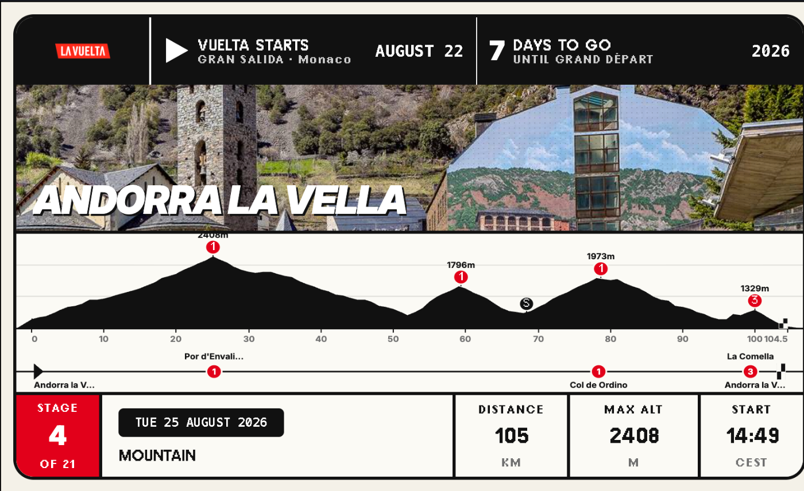

# trmnl-vuelta

A [TRMNL](https://usetrmnl.com) private plugin that shows today's La Vuelta a España stage: route, distance, stage type, start time, and a preview of tomorrow's stage. Once the general classification is live, the top 3 overall standings show in the header.

Forked from the "Tour de France Stages" plugin, pointed at La Vuelta instead of the Tour — La Vuelta runs on the same ASO Race Center platform, so the same fetch/shape logic applies almost unchanged.



*Live preview via `trmnlp serve`, showing the actual 2026 Grand Départ (Monaco, stage 1) pulled from `racecenter.lavuelta.es`.*

## How it works

The plugin uses TRMNL's [polling + serverless transform](https://docs.usetrmnl.com/go/private-plugins/create-a-plugin) strategy. `src/transform.js` is executed by TRMNL itself: it fetches the current year's stage list, checkpoint, and ranking data from `racecenter.lavuelta.es`, figures out which stage is "today" (before / during / after the race), and returns a shaped payload that the Liquid templates in `src/` render.

No separate backend or hosting is required — everything runs inside the TRMNL plugin.

## Layouts

- `full.liquid` — full-screen: GC/pre-race header, hero city photo, stage stats
- `half_horizontal.liquid` — wide half-screen
- `half_vertical.liquid` — tall half-screen, with hero photo
- `quadrant.liquid` — compact quarter-screen, text only

## Local preview

Requires Docker:

```sh
./bin/trmnlp serve
```

Then open `http://localhost:4567` to preview all four layouts against live data.

## Deploying to TRMNL

```sh
gem install trmnl_preview
trmnlp push --id 414982
```

`--id` targets the existing "Vuelta a España Stages" plugin. Omitting it creates a new, disconnected plugin instance instead of updating the live one.

Pushing requires a `TRMNL_API_KEY` (from your TRMNL account) set as the `TRMNL_API_KEY` secret on this repo, or exported in your shell for a manual push. The included GitHub Actions workflow (`.github/workflows/trmnl.yml`) lints on every PR and auto-pushes to TRMNL on merges to `main`.

## Disclaimer

Fan-made. Not affiliated with, endorsed by, or sponsored by ASO or La Vuelta a España.
